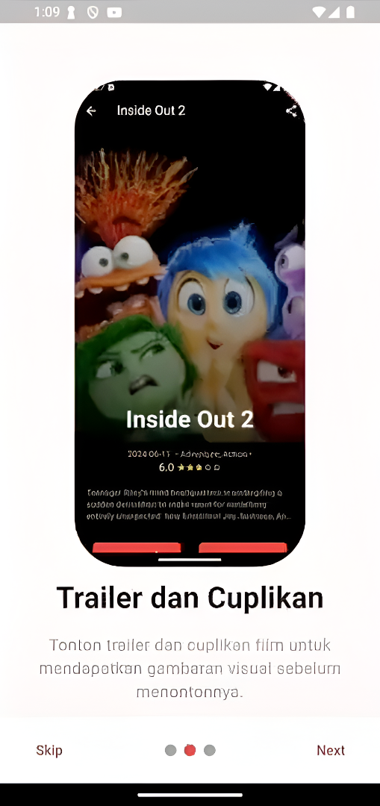
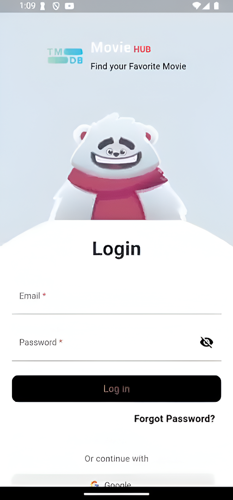
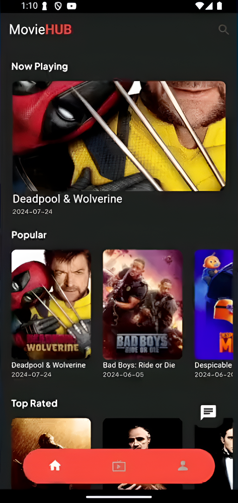
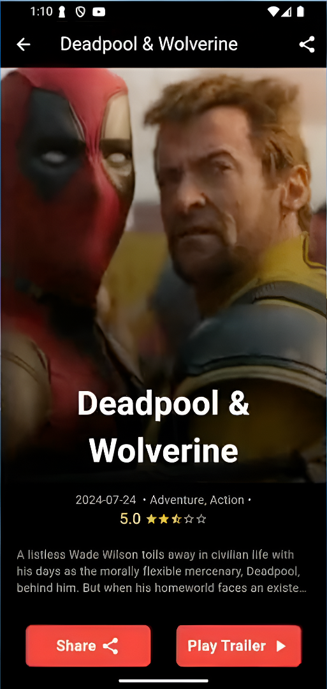

# Movie Hub

A modern, AI-powered movie and TV series discovery app built with Flutter.

---

## Features

- **Smart Discovery** — Browse "Now Playing", "Popular", "Top Rated", and "Upcoming" movies and TV series via the TMDB API.
- **AI Assistant** — Integrated Gemini AI chatbot for personalized movie recommendations based on your mood or preferences.
- **Trailers & Details** — Watch YouTube trailers and view detailed info including cast, ratings, and release dates.
- **Secure Auth** — Firebase Authentication with email/password and Google Sign-In support.
- **Smooth UI/UX** — Rive animations, floating action buttons, and a custom floating bottom navigation bar.
- **Push Notifications** — Stay updated on the latest releases via Firebase Cloud Messaging.

---

## Screenshots

|                           Get Started                            |                             Login                              |                           Home                            |                           Detail                            |
| :--------------------------------------------------------------: | :------------------------------------------------------------: | :-------------------------------------------------------: | :---------------------------------------------------------: |
|  |  |  |  |

---

## Tech Stack

| Layer            | Technology                                                                             |
| ---------------- | -------------------------------------------------------------------------------------- |
| Frontend         | [Flutter](https://flutter.dev)                                                         |
| State Management | [GetX](https://pub.dev/packages/get)                                                   |
| Backend          | [Firebase](https://firebase.google.com) (Auth, Firestore, FCM)                         |
| AI               | [Google Gemini](https://deepmind.google/technologies/gemini/)                          |
| Movie API        | [TMDB API](https://www.themoviedb.org/documentation/api)                               |
| Networking       | [Dio](https://pub.dev/packages/dio)                                                    |
| Animations       | [Rive](https://rive.app) + [Flutter Animate](https://pub.dev/packages/flutter_animate) |

---

## Getting Started

```bash
# Clone the repository
git clone https://github.com/your-username/movie-hub.git
cd movie-hub

# Install dependencies
flutter pub get

# Set up environment variables
# Create a .env file in the root directory:
# bearer=YOUR_TMDB_BEARER_TOKEN

# Run the app
flutter run
```

---

## How It Works

1. **Login** — Sign in with email/password or Google to personalize your experience.
2. **Explore** — Browse movies and TV shows on the dashboard or use the search feature.
3. **Chat with AI** — Tap the floating chat icon to get Gemini-powered recommendations.
4. **Watch** — View movie details, check ratings, and stream trailers in-app.

---

## Roadmap

- [ ] Watchlist feature to save movies
- [ ] Offline mode with local database
- [ ] Multi-language support
- [ ] Social sharing for movie recommendations

---

## Contributing

Contributions are welcome! Fork the repo, create a branch, and submit a pull request.

---

## License

This project is licensed under the [MIT License](LICENSE).
